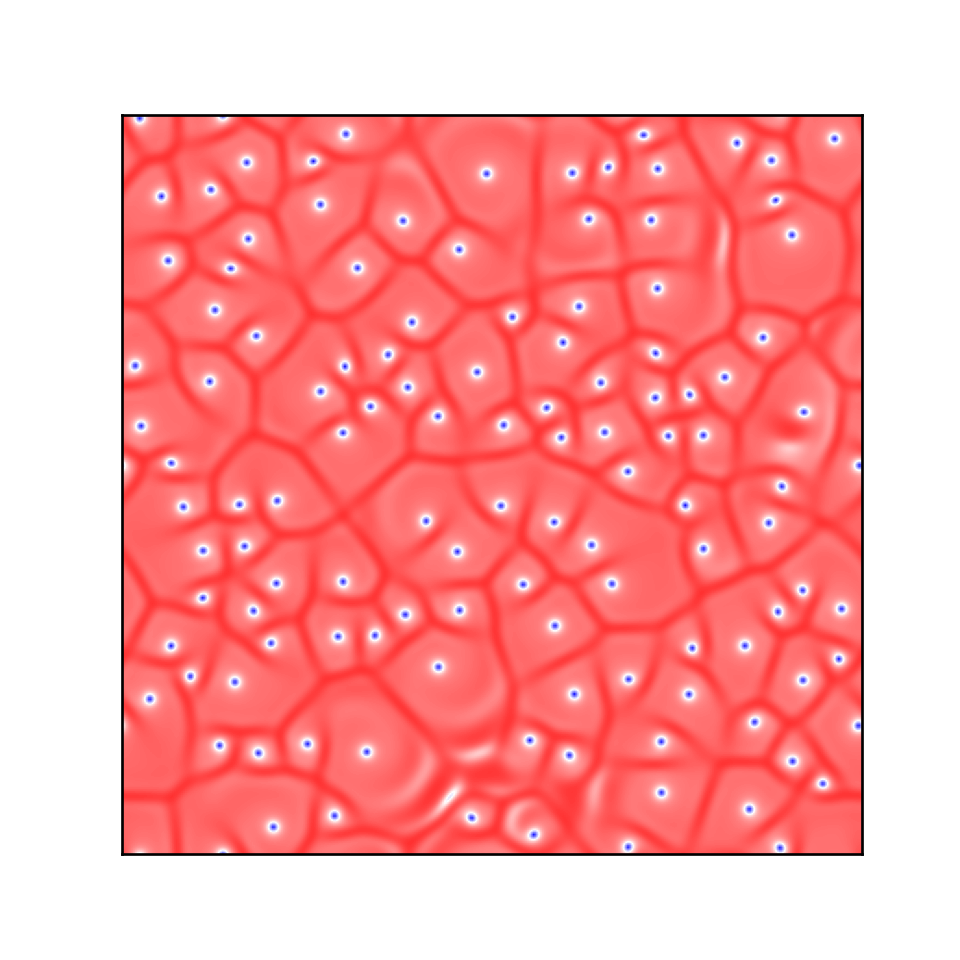

# superconductor-spectral-python
Spectral Solver for the Ginzburg-Landau equation

## Create Your Own Superconductor Simulation (With Python)

### Philip Mocz (2023) [@PMocz](https://twitter.com/PMocz)

### [📝 Read the Algorithm Write-up on Medium](https://philip-mocz.medium.com/create-your-own-superconductor-simulation-with-python-a206162945e)


Simulate a simplified version of the time-dependent complex Ginzburg-Landau equation with the Spectral method


```
python superconductor-spectral.py
```


